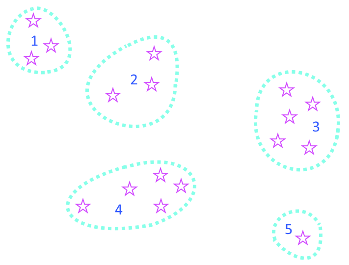
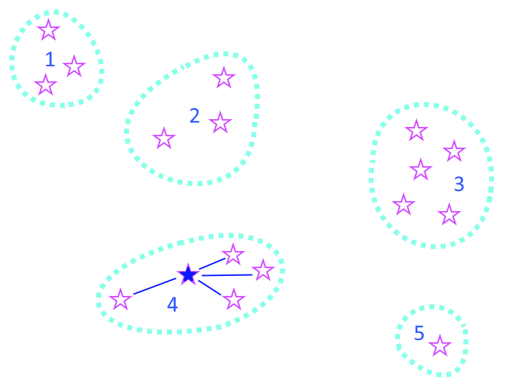
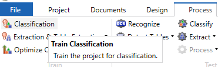
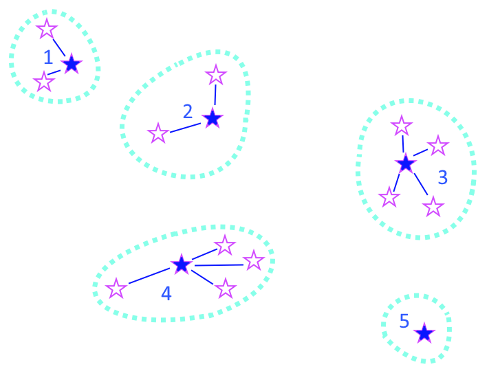

# Best Practices Guide to Classification
This guide will take you through important steps in designing and building your classification project.  
* [Class, Process and Field Analysis](#class-process-and-field-analysis).
* [Optimizing the Training Set](#optimizing-the-training-set).

This guide is additional notes to pages 43-52 of [Transformation Best Practices Guide](https://github.com/TungstenTransformation/Kofax-Transformation-Best-Practices), which you should download and read thoroughly.
## Class, Process and Field Analysis
*What "class" really means in Tungsten Transformation*  
"Classification" means different things to different people. Your customer might say that have 500 classes of documents. That does not mean that you need 500 **classes** in your Translation project. Maybe you only need 10 classes...  
A **Class** in Tungsten Transformation contains **Fields** and **Locators** and links to **business processes**. The fields are the names of the values that need to be exported. The Locators are the logic that finds them and the class has a one-on-one mapping to the name of a business process on the downstream workflow solution, whether that be TotalAgilty or another application.
### Classes and Fields
Your customer might have 500 "kinds" of documents but if 55 of them only require "customerID" and "date" to be extracted and you can use the same locators to find them then they are a single **class** in Transformation. Maybe the 55 variants are then really a selection in a drop-down list that can be found with another locator. Read 15-18 pages of [Transformation Best Practices Guide](https://github.com/TungstenTransformation/Kofax-Transformation-Best-Practices) where I describe how to do  field analysis to determine precisely the fields required and hence the real number of classes require.

Tungsten is often misunderstood as an AI widget or classification tool. That is not what we do. We **understand** documents to **drive down-stream business processes**. Below I will explain exactly what that means and how it makes your project precise, simple and massively increases your chances of success and your customer's productivity and satisfaction.

### Classes and Business Processes
When your customer says they have "500 classes" of documents, your first question should be about the business processes that these documents drive. It is highly unlikely they have 500 distinct processes - more likely they have 10 or so.  

The goal of Tungsten Transformation is to **understand** a document with the help of a Validation operator so that **exactly and only** the required information is correctly extracted to **drive a business process without any human needing to look at this document again.**  

A customer will always tell you they have "500 classes" and "50 fields" to be extracted from each document. Those "50 fields" where probably the columns in a database table somewhere. The reality is more likely to be that there are 10 classes and you need 10-14 fields per class. That is why you need to do the **Field Analysis Workshop** as mentioned in the book above with your customer (not the IT people, but the business people) to understand the precise purpose of every field and minimize the classes and fields, so that you have **exactly** the information required to drive every process. Challenge every single field until you get a valid justification for it. If they cannot justify it, then say "This field is out-of-scope of the project".  

Make the customer explain EVERY process and why that process needs exactly those 9 fields. Ask the question "if I give you those 9 fields and the process name (= classname) will you be able to process the document without looking at it again?" If they say "we need to look at the document?" then ask why and make sure you get that information in your project with the validation operator so that no-one needs to view the document again.
## Optimizing the Training Set
This content is on page 51 of [Transformation Best Practices Guide](https://github.com/TungstenTransformation/Kofax-Transformation-Best-Practices).
Don't just train 100's of samples into your project
* you may mistrain or overtrain. You may not find the problem documents.
* your project will be larger and slower.

Use the following steps to find the **minimal set** of training documents for maximal accuracy.
Often you only 1 or 2 training documents per class.
The following image shows 17 documents that classify into 5 different classes.

1. Pick a document which is clean, has excellent OCR and looks like lots of others in a class. Add it to the classification training set. In our example we will pick the central document in group 4 - it will possibly pick up the document to its left as well as the three to the right.

2. Click "Train Classification" on the project.  

3. Classify all the documents from that class and sort the documents by classification score.
4. Pick the document with the worst score and add it to the training set on the correct class. In our example it is likely that the documents from group 1 will get a bad score. We'll pick one that is most like its neighbours.

5. Repeat steps 2-4 until all of the documents have “good” (80% or more) classification confidence.  

This method will quickly find all the blue documents which are the best training documents. In a real-life project you may find that you only need 20 documents to correctly classify 1000 sample documents into 15 different classes.
