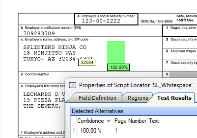
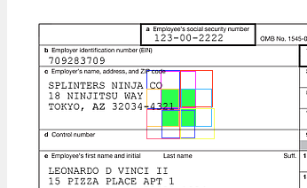

# Find a Blank Space in a Document
A blank space needs to be found on a document to insert a stamp/barcode/signature.  This script has two inputs 
* **WhiteSquareSize** in centimeters.
* **Margin** in centimeters (too avoid returning an area in the margin of the page)  
  

The script returns **one** result and that is the top-left most possible position on the earliest possible page. If no possible space can be found then it returns nothing.

This algorithm is fast. It uses the function **Blackness(Left,Top,Width,Height)** that returns 0.00 if a region of a page is perfectly white.  
It uses a recursive algorithm: 
1. Start with the entire page without borders.
1. If the region is white return success.
1. If the region is smaller than half the required width then return failure.
1. Shift the region around in all directions by half a width and test the 9 variants. If any is completely white then return success.  

1. If the region is not white, break it into 4 subregions and go to step 2.


```vb
'#Language "WWB-COM"
Option Explicit

' Class script: Whitespace

Private Sub SL_Whitespace_LocateAlternatives(ByVal pXDoc As CASCADELib.CscXDocument, ByVal pLocator As CASCADELib.CscXDocField)
   'This finds the FIRST Whitesquare on a document that is large enough
   Dim WhiteSquareSize As Double, Margin As Double, MarginW As Long, MarginH As Long, Width As Long, Height As Long, P As Long, Image As CscImage
   WhiteSquareSize = 2.0 ' centimeters
   Margin = 1.0 ' centimeters  . Don't look in the Margin of the document
   For P=0 To pXDoc.CDoc.Pages.Count-1 'Loop through each page of the XDocument
      Set Image=pXDoc.CDoc.Pages(0).GetImage()
      Width=WhiteSquareSize * Image.XResolution / 2.54  'converting cm to pixels using dpi And 1 inch = 2.54 cm
      Height=WhiteSquareSize * Image.YResolution / 2.54
      MarginW = Margin * Image.XResolution /2.54
      MarginH = Margin * Image.YResolution / 2.54
      Set Image=Image.BinarizeWithVRS()  'Use VRS to despeckle and binarize, so there are no spots on the image and no gray pixels.
      If Search(Image,P,MarginW,MarginH,Image.Width-MarginW*2,Image.Height-MarginH*2,Width,Height,pLocator.Alternatives) Then Exit For 'stop on the first page where we find a blank space.
   Next
End Sub

Private Function Search(Image As CscImage, P As Long, L As Long, T As Long, W As Long, H As Long, Width As Long, Height As Long, Alts As CscXDocFieldAlternatives) As Boolean
   'recursive function that breaks a region into quarters looking for a blank space
   If W<Width/2 Or H<Width/2 Then Return False  'too small
   If Image.GetBlackness(L,T,W,H)=0.0 Then  ' blank space found
       If W>=Width And H>=Height Then 'big enough?
         SetAnswer(Alts,P,L,T,W,H)  'this is the blank space we are looking for
         Return True  'stop searching and exit
       ElseIf Expand(Image,P,L,T,W,H,Width,Height,Alts) Then ' move the region around NorthWest,North,NE,E,SE,S,SW and West about trying to find a blank space
         Return True
      End If
   End If
   'Break region into 4 subregions and recurse
   If Search(Image,P,L    ,T    ,W/2,H/2,Width,Height,Alts) Then Return True
   If Search(Image,P,L+W/2,T    ,W/2,H/2,Width,Height,Alts) Then Return True
   If Search(Image,P,L    ,T+H/2,W/2,H/2,Width,Height,Alts) Then Return True
   If Search(Image,P,L+W/2,T+H/2,W/2,H/2,Width,Height,Alts) Then Return True
   Return False 'failed to find anything - there is no blank space anywhere on this document
End Function

Private Function Expand(Image As CscImage, P As Long, L As Long, T As Long, W As Long, H As Long, Width As Long, Height As Long, Alts As CscXDocFieldAlternatives) As Boolean
   Dim DL As Long, DT As Long
   'move the region around the current spot and try the 9 options.
   For DL=max(0,L-W/2) To min(Image.Width-W/2,L+3*W/2) Step W/2
      For DT=max(0,H-P/2) To min(Image.Height-W/2,H+3*W/2) Step H/2
         If Image.GetBlackness(DL,DT,W,H)=0.0 Then  ' we found a blank stop
            SetAnswer(Alts,P,DL,DT,W,H)
            Return True
         End If
      Next
   Next
   Return False ' none of the 9 shifted regions worked
End Function

Private Sub SetAnswer(Alts As CscXDocFieldAlternatives,P As Long,L As Long,T As Long,W As Long,H As Long)
   ' write the coordinates of the blank spot into the script locator
      With Alts.Create
         .PageIndex=P
         .Left=L
         .Top=T
         .Width=W
         .Height=H
         .Confidence=1
      End With
End Sub

Function min(a,b) 'minimum function
   Return IIf(a<b,a,b)
End Function

Function max(a,b)  'maximum function
   Return IIf(a>b,a,b)
End Function
```