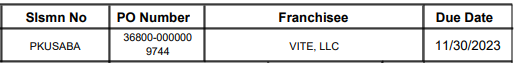
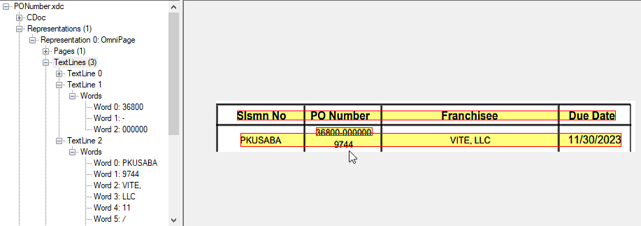
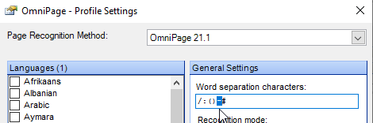
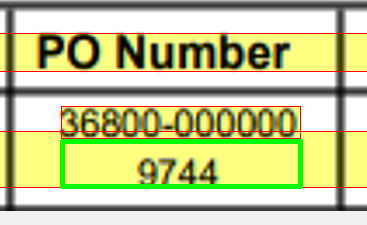
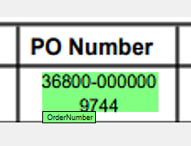
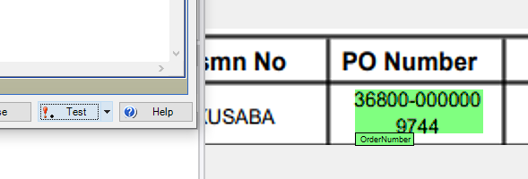
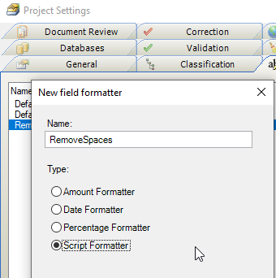

# How to make a multiline Locator. 
In the following document we have a multiline PO Number. Neither the Format locator, nor any of the Group Locators (Order Group Locator, Trainable Group Locator, ...) will find the entire value, since most locators stay within a single textline.  
  

## Solution Idea 
We know that the PO Number should be 16 characters long. We can test if including the word(s) directly below what the locator found is closer to 16 characters. "36800-000000" is 12 characters and has error=4, but "36800-0000009744" is 16 characters long with an error=0 and so is the better option.

## Analysis
If we open the XDoc in the XDocBrowser we can inspect the OCR Text Lines within the first **Representation**.



We see that the PO Number is 3 words (**368000, -, 000000**) in line 1 and that **9744** is word 1 in textline 2.  
In the OCR Settings, "-" is considered a word separation character, that is why the PO Number is 3 words long!


We will write a script that looks inside the green rectangle below, calculating carefully the **top, left, width and height** of the green rectangle. 
  
We have to be careful here because TextLine 1 and TextLine 2 overlap due to the misalignment of the PO Number column bacause of  central vertical cell alignment and  word wrapping.


# Script 
We will assume that the PO Number is found by either Order Group Locator, Trainable Group Locator, or is in an Advanced Evaluator. If you use a Format Locator to find it, then you should flow that into an Advanced Evaluator. Each of these locators contains the **OrderNumber** as a **SubField** and not an **Alternative**.  
The script below does the following.
* customizes the **OrderNumber** locator.
* Finds which OCR words were used in the subfield by calling the wonderful function **pXDoc.GetWordsInRectangle()** using the subfield's own coordinates. This will give us the three words "36800", "-", "000000" and all of their coordinates and importantly, their Text Line Index.
* Calculate the green rectangle by considering the **next** TextLine.  
 
* Run a Field Formatter on the Text. The OCR result is "36800 - 0000009744" but we need "36800 - 0000009744" because we want to measure the length of the value. We will use a Field Formatter called **RemoveSpaces** to do that. *See second script below for an example.*
* Calculate if the subfield text is closer to 16 in length than the subfield text +green box text is. If the green box is "better" then **append** the green box words to the subfield. **Appending** words to a subfield or field expands the bounding box automatically so that the subfield highlighting shows correctly on the document in green.  
  
* You can now simply click **Test** on the locator and see the result.
  

### Class level script
Put this script into the class containing your OrderNumber locator
```vb
Option Explicit

' Class script: NewClass1

Private Sub Document_AfterLocate(ByVal pXDoc As CASCADELib.CscXDocument, ByVal LocatorName As String)
   'This Sub allows us to customize any locator. This is called AFTER the locator has run and gives us full control to edit the results of the locator however we want. It is compatible with the 'Test' button in the Locator Configuration.
   Select Case LocatorName
   Case "OGL"  ' This is the name of YOUR locator
      'This is the name of the subfield, the expected length in characters and the optional name of the field formatter used to clean the subfield.
      SubField_CheckWordBelow(pXDoc,LocatorName,"OrderNumber", 16,"RemoveSpaces")
   End Select
End Sub

Sub SubField_CheckWordBelow(pXDoc As CASCADELib.CscXDocument,LocatorName As String, SubFieldName As String, ExpectedLength As Long, FormatterName As String)
   'This Subroutine will check the subfield with the given name in each alternative in the locator
   'and check if including the text directly below it will give a result that is closer to ExpectedLength.
   'It will use the optional Formatter included, as that formatter may be needed to remove spaces or unnecessary characters
   Dim Alternatives As CscXDocFieldAlternatives, A As Long, SF As CscXDocSubField, Rectangle As New CscXDocField, Words As CscXDocWords, W As Long, TextLineIndex As Long
   Dim FieldFormatter As CscFieldFormat
   Set Alternatives=pXDoc.Locators.ItemByName(LocatorName).Alternatives
   'Loop through all the alternatives of the locator. Perhaps there are multiple results on the document
   For A=0 To Alternatives.Count-1
      'Find the Subfield we want to test
      Set SF=Alternatives(A).SubFields.ItemByName(SubFieldName)
      'Make a rectangle using the width of the subfield
      With Rectangle
         .PageIndex=SF.PageIndex
         .Left=SF.Left
         .Width=SF.Width
         'Set the height of the rectangle to the height of the subfield
         .Top=SF.Top
         .Height=SF.Height

         'Recover the OCR words used to fill this subfield. We need to find the OCR words, so we can get the line index, so we can look at the line below
         Set Words=pXDoc.GetWordsInRect(.PageIndex,.Left,.Top,.Width,.Height)
         If Words.Count>0 Then ' It's possible that the subfield failed to find anything, so nothing to do!
            'Add the OCR words into the subfield and format it
            If SF.Words.Count=0 Then
               For W= 0 To Words.Count-1
                  SF.Words.Append(Words(W))
               Next
               SF.Text=Text_Format(SF.Text,FormatterName)
            End If
            'Go to the textline below the subfield
            TextLineIndex=Words(0).LineIndex+1
            If TextLineIndex<pXDoc.TextLines.Count Then 'Make sure we are not on the last line of the document!!
               .PageIndex=SF.PageIndex
               'Carefully find the top, by taking the lower of the top of the next text line and the bottom of the current subfield, since textlines might be overlapping
               .Top=Max(pXDoc.TextLines(TextLineIndex).Top, Words(0).Top+Words(0).Height+1)
               'Set the height to give the correct bottom of the second text line
               .Height=pXDoc.TextLines(TextLineIndex).Top-.Top+ pXDoc.TextLines(TextLineIndex).Height-1
               'Find the words underneath
               Set Words=pXDoc.GetWordsInRect(.PageIndex,.Left,.Top,.Width,.Height)
               'Is this a better result than not including the words below
               If Abs(Len(Words.Text)+Len(SF.Text)-ExpectedLength) <Abs(Len(SF.Text)-ExpectedLength) Then
                  'Yes, including the words below is better, so append the words - this also will highlight the words in green in Validation
                  For W=0 To Words.Count-1
                     SF.Words.Append(Words(W))
                  Next
               End If
            End If
         End If
      End With
   Next
End Sub

Function Max(A,B)
   If A>B Then Max=A Else Max=B
End Function

Function Text_Format(Value As String, FormatterName) As String
   'Format a text using a field Formatter. We don't care if it fails or not.
   If FormatterName="" Then
      Text_Format=Value
   Else
      Dim Field As New CscXDocField
      Field.Text=Value
      Project.FieldFormatters.ItemByName(FormatterName).FormatField(Field)
      Text_Format=Field.Text
   End If
End Function
```
Put this script into the Project Class and configure it as a **Script Formatter** in the **Project Settings**.

```vb
Private Sub RemoveSpaces_FormatField(ByVal FieldText As String, FormattedText As String, ErrDescription As String, ValidFormat As Boolean)
   FormattedText = Replace(FieldText, " ", "")
   ValidFormat = True
End Sub
```
