## Table Benchmarking in Tungsten Total Agility.
This article shows you how to add a table benchmark to your Transformation Project. It uses the standard Extraction Benchmark. 
This process was designed for TotalAgility, though it will also work in KTM and RPA.

We'll explain the Table Benchmark with an example.

Here is the **truth** that the Table Locator should have found.
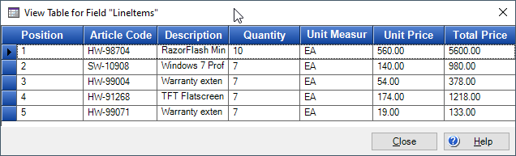  
The **Extraction Benchmark** looks like this:  
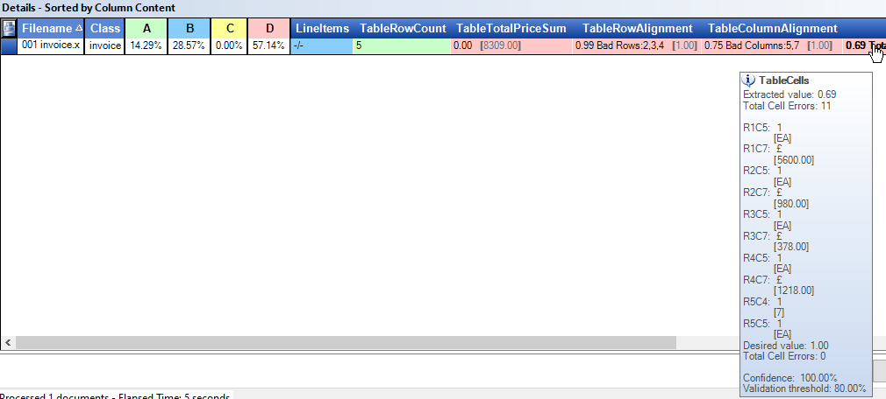
There are 5 Table Benchmark Fields  

* **TableRowCount** *This contains a green *5*, meaning that the locator found 5 **rows** and 5 is the truth.*
* **TableTotalPriceSum** *The locator found **0.00** as the sum of the **Total Price** column, but it should have found **8309.00**.*
* **TableRowAlignment** *The table locator matched all the rows to a pixel accuracy of 99%. This means that there are no problems with row detection. Rows 2, 3 and 4 have a discrepancy of only a few pixels.*
* **TableColumnAlignment** *75% of the columns are aligned. Columns 5 and 7 are wrong.*
Look at the colored image below
  * The areas in **green** are where the Table Locator found the correct values.
  * The areas in **light blue** are where the Table Locator **failed**.  The Table locator failed in 11 cells. It failed to find the 5 Unit cells, missed the 5 amounts in the total price and failed to read the **7** on the last row.
  * those two horizontal red lines are marking the 25% misalignment between the table locator and the truth.  
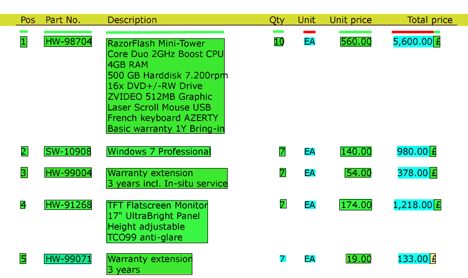

## The Overall Process.
*Here is an overview of each step, which is giving in detail later below. The steps show how to load documents into Designer - run them through Extraction AND Validation in TotalAgility to manually correct table extraction, and how to get the true field values back into the XDocs in Transformation Designer to be able to run Benchmarks.* 
* In Transformation Designer
  * Collect sample documents. Load them into a test set in Transformation Designer. Attach test set to the project and Convert this to a benchmark set.
* In TotalAgility
  * Create a normal Transformation process in TotalAgility.
  * Make sure image processing is enabled if using PDF documents.
  * Turn on online-learning.
  * Add Activities for storing the original document name into the XDocument, so Transformation Designer can know the original file name.
* Import your benchmark documents into TotalAgility scan application.
* In TotalAgility Validation validate your documents making sure that every field and table cell is perfect. Add the document to online-learning.
* In Transformation Designer
  *import new training samples.
  * Drag these new samples into a new test set.
  * Add the [Table Benchmark Script](/TungstenTransformation/TableBenchmark/blob/main/tablebenchmark.md) to your project's class script.
  * Extract (F6) your new samples. This will copy the truth into your benchmark training set.
  * Run the Extraction Benchmark.
* If you made errors in the Benchmark files, then retry those files in TotalAgility Validation and correct your errors.

## Add the Benchmark fields to your project
* Add all of the Table Metafields to your project.  

* Set the fields to be **Always Valid** so you can ignore them in Validation. You can also remove this fields from Validation form if you like.  

## Design your workflow in TotalAgility
* Your workflow needs to include these steps.  

* you will need these variables.  

* You will need to lasso the documents in Validation to correct any extraction errors. You cannot lasso a PDF document, so add an **Image Processing** activity if you want to use PDF documents and their text layer.  

* Make sure that in the process settings, you are using PDF Text.  Click on blank-space in process map and Click "Capture" Settings. 

* After Classifying the documents you need to loop through all the documents and store the original filename into an **XValue** so that Tungsten Transformation can find the original test document again.
* Add a **Loop** Activity over the documents called *Loop Documents*.  

* Add a **Decision** Activity called *Row Found?* where the true path goes to activity *Set filename*.  The false path continues on to the **Extract** Activity.

* The *Set filename* activity copies the imported filename (png or tiff) into the XDocument. it as a **.Net** Activity.  

* Add an **Ordinary activity** called *Stop* after the Validation activity. It is there for to keep the documents in TotalAgility until we are certain that we correctly validated them. Leave the documents there until you have run the benchmark. One of the advantages of a benchmark is that it will show you when you incorrectly validated a document. It gives you the opportunity to send the documents BACK into Validation so that you can fix your validation mistakes without having to import the documents again.
* The *Stop* activity contains a check box called *Retry* which sends the documents back into Validation.  
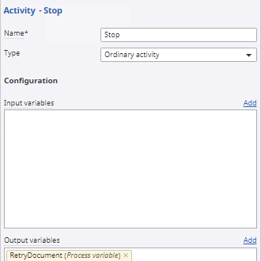
* Add a **Branching Rule** to the *Stop* Activity in the *After processing* configuration.  
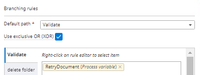
## Configure Transformation Designer
* Add the [Table_Benchmark script](https://github.com/TungsteTransformation/TableBenchmark/blob/main/tablebenchmark.md) to the class containing your table locator and 5 benchmark fields.
* **Load documents** into Transformation Designer.
* **Attach** your Document Set to the Project. *This is VERY important. it must be attached so that the script can know where the document set is to be able to find the original Xdoc.*   
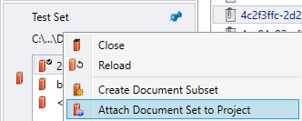
*  **convert** them to a **Benchmark Set**, so that you will be able to run the Extraction Benchmark.   
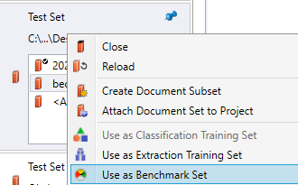
## Create Truth Files
* Import your benchmark files into TotalAgility Scan Job.  
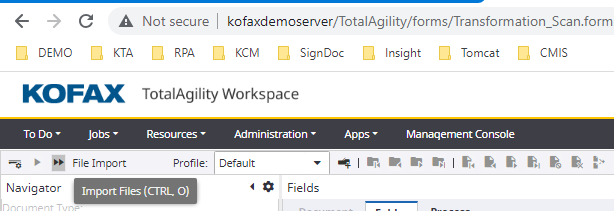
* In TotalAgility Validation make your tables Perfect. Use the add/delete/interpolate table row features.
* Add each document to online learning.
## Import into Transformation Designer
* Import new samples from TotalAgility from Menu **Documents/DownloadNewSamples**.  
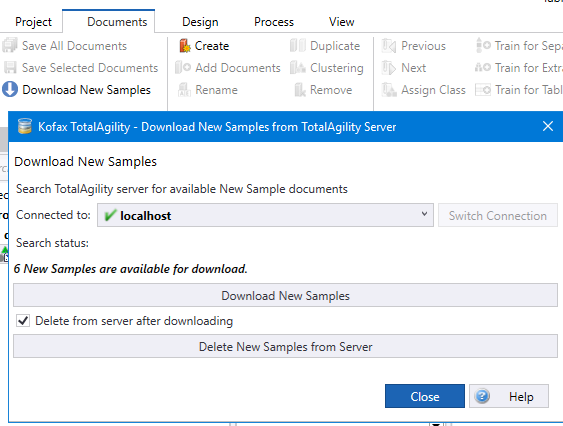
* You will see that they have the correct field and table values, but the table benchmark fields are incorrect.  
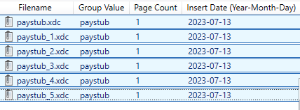
* These files cannot be extracted in this folder. Right-click on the documents and select **Open in Windows Explorer**. Copy them into a new folder call *truth files*.  
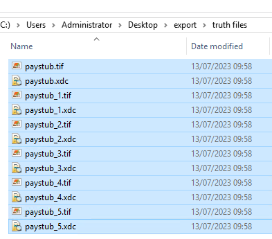
* Open this folder as a Document Set.  
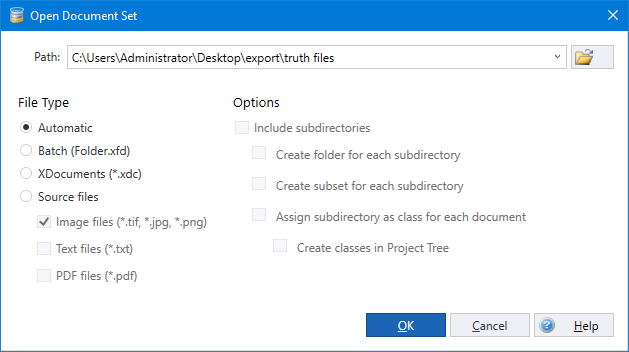
* Extract the imported documents. This will add the perfect benchmark fields (100% match for everything) to the original XDoc that is in the benchmark set.
* reload the benchmark set.
* run the benchmark.
