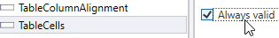

## Table Benchmark.
This article shows you how to add a table benchmark to your Transformation Project. It uses the standard Extraction Benchmark. 
This works for any version of KTM, KTT or KTA.  
The benchmark looks like this:  

There are 5 Table Benchmark Fields  

* **TableRowCount** *This table has the correct number of rows 5.*
* **TableTotalPriceSum** *This table has the incorrect column sum of 0.00. it should have 8309.00.*
* **TableRowAlignment** *81% of the rows are aligned. Rows 1 & 4 are misaligned.*
* **TableColumnAlignment** *87% of the columns are aligned. Column 7 is misaligned.*
* **TableCells** *7 cells contain the wrong text.*

This example uses [this sample document].  The correct table seen below, but I manually removed 3 text lines from row 1 and 2 textlines from row 4, just to show how the benchmark works.

The **Automatic Table Locator** incorrectly reads the **Total Price** column, which is really useful for testing a benchmark!  

## Add the Benchmark fields to your project
* Add the 5 benchmark fields to your project

* Set each field to be always valid.  

  * Add the script [Table_Benchmark.vb](Table_Benchmark.vb) to the class containing your table locator and 5 benchmark fields.
## Prepare your benchmark.
* See [Tables_AdvancedTableLocatorGuideForKTA.md] for creating truth documents (golden files) for your benchmark set.
* Run the Extraction Benchmark.
