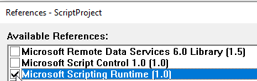

# Text Layout Algorithm (called "TL" below)
Text Layout uses the location of **every unique word** on the page to either [classify a page](https://github.com/KofaxTransformation/KTScripts/blob/master/Text%20Layout%20Classification%20and%20Registration.md#text-layout-classification) or [register OCR zones](https://github.com/KofaxTransformation/KTScripts/blob/master/Text%20Layout%20Classification%20and%20Registration.md#text-layout-zone-registration).  

Text Layout allows subpixel accuracy in **registering** OCR zones because we  use 100s of words on the page to do the registration.

Text Layout  allows **very precise classification** because if the documents are only slightly different then words don't have the same alignment with each other. This can easily detect when an extra line of text has been added to the middle of a document.

Every unique word on the page is *aligned* to its corresponding word on the other document. This gives the precise vertical shift and stretch, and horizontal shift and stretch. Text Layout is VERY robust against OCR errors because even if 60% of the words had OCR errors, we would still find the correct alignment with the remaining 40% easily.  

TL takes a fraction of a second for the comparison between the document and the training sample in the project class.

## Text Layout Classification
Text Layout Classification is very useful when
*  2 document classes differ only by a few words. Maybe an extra sentence or 1 less sentence.

 If you use it to compare with 10 documents, then it would take a few seconds. It is best to classify documents with the in-built fast "Layout Classification" and "Text Classification", and then do sub-classification with the variants of a class.  
Here is a Classification Benchmark for a set of Japanese Forms that are almost identical with each other - they vary only in a few words and phrases.  
 

 ### Example.
 Your project has document classes **A**, **B** and **C**, which are quite different from each other, so standard layout or text classification can be used. Document **B** has variants **B1** to **B6** that are quite similiar to each other and are subclasses of **B** because although they have the same fields, some or all of the locators need to be different.    
 After a document is either classified as **B** or **B1** to **B6**, Text Layout Classification can be used to test the document with all 7 classes with the *Text Layout* algorithm and assigns the document to the class with the best match.

## Add Text Layout Classification to your Project
* Open the Project Level Script.  
* Add [this line](https://www.winwrap.com/web2/basic/#!/ref/WWB-doc_language_def.htm) to the top of your project level script.
```vb
'#Language "WWB-COM"
```
* Add a Reference to **Microsoft Scripting Runtime** in Menu/Edit/References. We use a [Dictionary](https://learn.microsoft.com/en-us/office/vba/Language/Reference/User-Interface-Help/dictionary-object) to find and match words on the page.  

* Add the [Text Layout Classification](/Text%20Layout%20Classification.vb) script to the Project Level Class.
* Add the [Text Layout](/Text%20Layout.vb) script to the Project level Class.
* Add classification training samples to your classes.
* Press F5 to classify your documents.


## Text Layout Zone Registration
This algorithm is very useful when you need to perform OCR on a document and the document 
* has MANY background words on the page, as is typical on a US government or insurance form.
* is highly stretched in one direction. 
* has a strong zoom (e.g. a photo from a mobile phone with the camera far back) 
* came from a mobile phone and the camera was at an angle to the paper.
* has zones shifted more than 10mm.

Text Layout Registration uses **every unique word** on the page as an anchor. This is much better and robuster than manually configuring a few anchors yourself.  

**NOTICE** Please test the **Advanced Zone Locator** with the following registration settings *before* you try this algorithm.
Usually these settings mean you do not need to use my custom algorithm.
1. Make sure Registration Type is **custom**
1. Disable **Anchors** (don't use anchors as they are lots of work and don't do as good a job 
1. Enable **Lines** if your document has many vertical and horizontal lines on it
1. Enable **OCR** if your document has a lot of background text (which is what Layout Classification uses as well!)
1. Enable **Layout**.
1. Enable **Account for Local Distortion**.   (TL checks for distortion across the whole page)
1. Set **Local re-registration** to max of 10 mm horizontally and vertically. (my algorithm has unlimited re-registration distance)
1. Disable **Registration Failure makes zone invalid** as you want to see where the zones would be found.


Only if the above registration settings fail should you try to use this script.

Improvements in 5 October 2023
* Fixed issues with multipage documents. #6, #8 
* Pages without zones are skipped.  #7  

Improvements on 23 September 2022
* mismatched words are ignored. (outliers to the linear regression are removed and the line of best fit is recalculated) This makes the algorithm precise and robust.
* It now only requires a single script locator essentially for debugging. The script event **Document_BeforeLocate** is now used to run the zone shifting from *within* the Advanced Zone Locator. 
* improved documentation. 

## Add Text Layout Registration to your Project
* Open the Script Editor in Kofax Transformation.
* Add a Reference to **Microsoft Scripting Runtime** in Menu/Edit/References. We use a [Dictionary](https://learn.microsoft.com/en-us/office/vba/Language/Reference/User-Interface-Help/dictionary-object) to find and match words on the page.  

* Add a reference to **Kofax Advanced Zone Locator 4.0**.
* Add [this line](https://www.winwrap.com/web2/basic/#!/ref/WWB-doc_language_def.htm)  to every Project Class that you will use for Zone Registration.
```vb
'#Language "WWB-COM"
```
* Add the [Text Layout Zone Registration](/Text%20Layout%20Zone%20Registration.vb) script to the Class script.
* Add the [Text Layout](/Text%20Layout.vb) script to the Class script.
* Add the Script Locator **SL_CalculatePageShift** to your project.  
* Add the Subfields  **Scale**, **Shift**, **Confidence**, **Words** and **DPI** to the locator. These are used both for debugging and are used in the Zone Locator to shift the zones.  


* Disable Registration in the Advanced Zone Locator. Remove all anchors from the AZL - you won't need them.
* Configure all of the Zones in the AZL.
* Test the AZL. If Text Layout finds enough anchors it should shift all of your zones perfectly.

### Notes
* The documents need to be linearly stretched for this to work.
* If the paper is curved and photographed it won't work. (Contact me if you need this to work for curved paper).
* If it is a fax that slipped while printing it won't work.

Kofax Transformation has support for adjusting the zones of a Zone Locator by script - we will use this technique here as well.

## How Text Layout Registration Works
1. Find all unique words on Document A (This is the document you want to classify or register) using a Dictionary object. This is very fast.
2. Find all unique words on Document B (This is either the classification sample document or Zone Locator's sample document)
3. Find all unique words on Document A that are on Document B. These are the anchor words we will use to align the documents.
4. Plot the X coordinate of each word in Document A against the X coordinate of each word in Document B and calculate the line passing through them using [linear regression](https://www.easycalculation.com/statistics/learn-regression.php), a High School math technique.  


5. Linear Regression calculates 
* the slope, M, of the line corresponds to the **scale**. In the example you see that the document is 2.091 times *wider* than the original document and 2.090 times *higher*.
* the intercept, B, of the line corresponds to the **pixel shift**. In the example you see that the document has shifted -37.2 pixels horizontally and 189.7 pixels vertically
* the **Confidence**, R, of the line, shows how well the dots fit on a straight line. 1.0000 shows perfect both horizontally and vertically.
* This example used 75 unique words that matched between the two documents as anchors.   

* After this each word will be tested to find it's distance from the line. Any word that is too far from the line will be removed.
* the line will be recalculated without the mismatched words.